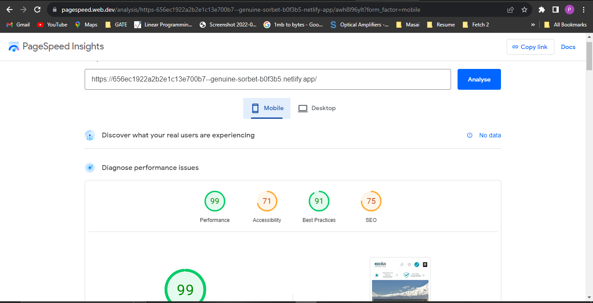

# About this project:
* This is a static web page, has been developed using CSS, HTML, Javascript.
* It is a responsive web page.
* It has one file for HTML, one for CSS and one for Javascript.
* It has only one functionality i.e. "Show" and "Hide" some content after clicking on "Show More" and "Show Less" buttun respectively.

## Web Page Performance:
* I checked  performance of the web page on pagespeed.dev and below is the result.

  

## Deployed Link:
* I have deployed this application on Netlify. Below is the deployed link.

* https://656ec1922a2b2e1c13e700b7--genuine-sorbet-b0f3b5.netlify.app/

